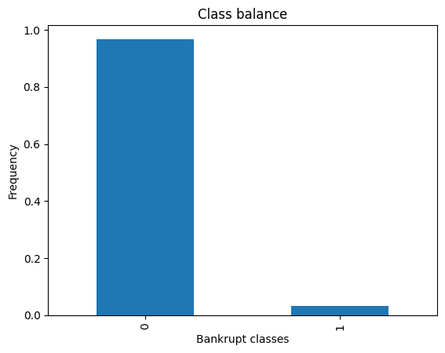
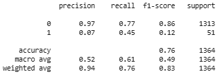
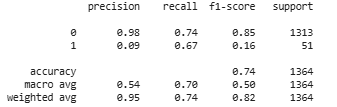
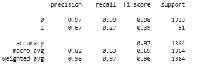
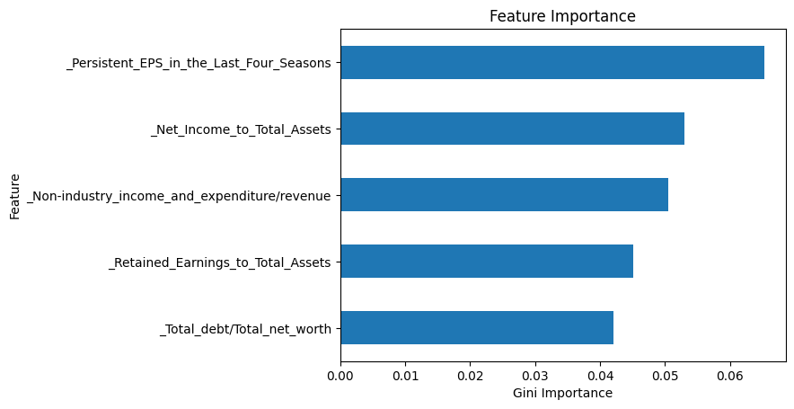

# 👥 Company Survival Analysis: Bankruptcy Prediction Model

**Prediction Model**: [Colab](https://colab.research.google.com/drive/1guX9eDH4hbpQOe218D8xmNv6JlLHSNU0?usp=sharing????https://public.tableau.com/app/profile/larasati.syarafina/viz/HRAnalysisDashboard-Pacmann/Dashboard1?publish=yes)

**Dataset**: [Bankruptcy Data](https://www.kaggle.com/datasets/fedesoriano/company-bankruptcy-prediction/data)

## 🌟 EDA

### 📋 Frequecy Betweeen Bankrupt vs No Bankrupt

Ditemukan bahwa jumlah company yang mengalami bankrupt hanya sedikit dibandingkan company yang tidak mengalami bankrupt. Dalam proses pembuatan model machine learning, kondisi ketimpangan kelas ini merupakan kondisi imbalance class. Adanya kondisi ini dapat mempengaruhi kinerja model Machine Learning karena cenderung bias terhadap kelas yang lain sehingga perlu dilakukan sampling untuk mengatasinya.

### 📋 Oversampling
Proses oversample dilakukan menggunakan library RandomOverSample yang menambahkan sample kelas minoritas secara acak atau random.

## 🌟 Modeling
Selanjutnya, dibuat tiga model Machine Learning untuk memprediksi Bankrupt. 

### ⌛ Logistic Regression

Model LR dapat memprediksi dengan tingkat akurasi sebesar 76%.

### ⌛ Support Vector Machine

Model LR dapat memprediksi dengan tingkat akurasi sebesar 74%.

### ⌛ Random Forest

Model LR dapat memprediksi dengan tingkat akurasi sebesar 97%.

Dari ketiga model ini, model Random Forest memiliki akurasi tertinggi sehingga model ini adalah model yang paling direkomendasikan. Namun, model yang telah dilatih masih menggunakan default parameter sehingga dilakukan hyperparameter tuning untuk mendapatkan kombinasi parameter yang dibutuhkan.

### 📋 Hyperparameter Tuning Random Forest
Proses tuning dilakukan menggunakan GridSearchCV yang bekerja dengan melakukan percobaan setiap kombinasi parameter yang telah diinput. Kombinasi parameter dengan hasil terbaik adalah 'max_depth' = 50 dan 'n_estimators' = 25 dengan perolehan akurasi 96%. Didapatkan bahwa hasil hyperparameter tuning memperoleh nilai akurasi yang sedikit lebih rendah dibandingkan dengan model Random Forest dengan default parameter. 

### 📋 Feature Importance
Pada algoritma Random Forest, terdapat fungsi feature importance yang dapat dimanfaatkan untuk mengetahui fitur-fitur yang penting dalam model prediksi. Hal ini berguna terutama untuk data yang terdiri dari banyak fitur. 

Berdasarkan skor importance, 5 fitur yang memiliki peran penting dalam memprediksi perusahaan bangkrut adalah

* Per share net profit before tax
* Continuous interest rate (after tax)
* After tax net interest rate
* Net income to total assets
* Retained earnings to total assets

## 🌟 Summary
Model Bankruptcy Prediction memperoleh akurasi tertinggi di angka 97% menggunakan algoritma Random Forest Classifier dengan default parameter. 
